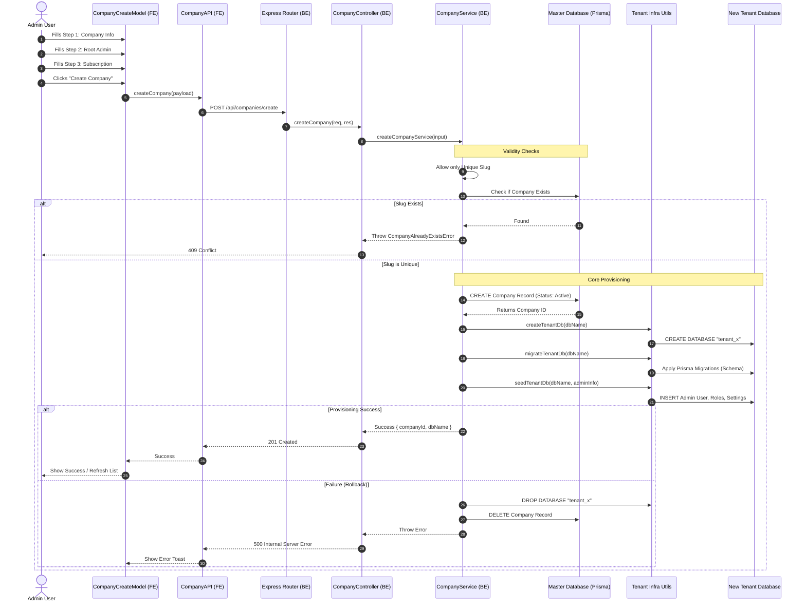

# Company Create Flow Documentation

## 1. Overview
The "Company Create Flow" is a critical onboarding process that provisions a new tenant in the GreenCity SaaS platform. It involves collecting user/company details, validating them, creating a record in the Master Database, and concurrently provisioning a dedicated Tenant Database with its own schema and initial seed data.

## 2. Files Involved

| Tier | File Path | Purpose |
| :--- | :--- | :--- |
| **Frontend** | `apps/frontend/src/components/models/CompanyCreateModel.tsx` | **UI Component**: Multi-step modal for collecting company info, root admin details, and subscription plan. Handles client-side state and feedback. |
| **Frontend** | `apps/frontend/src/services/company.api.ts` | **API Service**: Typesafe wrapper for `fetch`. calls the backend `POST /api/companies/create` endpoint. |
| **Backend** | `apps/backend/src/routes/company.routes.ts` | **Router**: Express router that maps the URL path `POST /companies/create` to the correct controller function. |
| **Backend** | `apps/backend/src/controllers/company.controller.ts` | **Controller**: Validates the HTTP request payload structure (Company Info, Admin, Subscription) and delegates to the service. Handles HTTP errors. |
| **Backend** | `apps/backend/src/services/company.service.ts` | **Service**: The core orchestrator. Handles uniqueness checks, Master DB insertion, and triggers Tenant DB provisioning (Create, Migrate, Seed). |
| **Infra** | `apps/backend/src/infra/createTenantDb.ts` | **Infrastructure**: Raw SQL utility to create a physical PostgreSQL database for the new tenant. |
| **Infra** | `apps/backend/src/infra/migrateTenantDb.ts` | **Infrastructure**: Runs Prisma Migrations on the newly created tenant DB to set up the schema. |
| **Infra** | `apps/backend/src/infra/seedTenantDb.ts` | **Infrastructure**: Populates the new Tenant DB with initial data (Admin User, Default Settings, etc.). |

## 3. Data Flow Diagram (DFD)

The following sequence diagram illustrates the end-to-end flow from the User Interface to the Database Infrastructure.



## 4. Detailed Step-by-Step Flow

### Phase 1: Frontend Input Collection
1.  **User Action**: User opens the "Add New Company" modal.
2.  **`CompanyCreateModel.tsx`**:
    *   Manages a multi-step form state (1. Details, 2. Admin, 3. Subscription).
    *   Collects data into a nested object:
        ```typescript
        {
          companyInfo: { ... },
          rootAdmin: { ... },
          subscription: { ... }
        }
        ```
    *   On submission, calls the `onSubmit` handler which triggers `company.api.ts`.
3.  **`company.api.ts`**:
    *   Sends a JSON `POST` request to `{API_BASE}/api/companies/create`.
    *   Handles network errors and parses the response.

### Phase 2: Backend Validation & Orchestration
1.  **Router**: `apps/backend/src/routes/company.routes.ts` receives the request and directs it to `company.controller.ts`.
2.  **Controller**:
    *   Checks for essential fields (e.g., `companyName`, `rootAdmin.email`).
    *   If invalid, returns `400 Bad Request`.
    *   If valid, calls `createCompanyService`.
3.  **Service (`company.service.ts`)**:
    *   **Slug Generation**: Converts "My Company" -> "my-company".
    *   **DB Name Generation**: Converts "My Company" -> "company_my_company" (safe for Postgres).
    *   **Uniqueness Check**: Queries `prismaSuperUser` to ensure the slug is unique. If not, throws `CompanyAlreadyExistsError`.

### Phase 3: Infrastructure Provisioning (The "Heavy Lifting")
This is the most critical part of the flow. It happens sequentially to ensure data integrity.

1.  **Master Record Creation**:
    *   A record is created in the **Master Database** (`Company` table). This acts as the registry for all tenants.
    *   Status is set to `active`.
2.  **Tenant DB Creation**:
    *   `createTenantDb` connects to Postgres as a superuser and executes `CREATE DATABASE`.
3.  **Schema Migration**:
    *   `migrateTenantDb` runs programmatically (likely using `prisma migrate deploy`) against the *newly created* database URL.
    *   This ensures the new tenant has all the tables (`User`, `Product`, `Order`, etc.) defined in the tenant schema.
4.  **Seeding**:
    *   `seedTenantDb` connects to the new tenant DB.
    *   It creates the **Root Admin** user using the details provided in step 2 of the form.
    *   It executes any other necessary setup (default roles, permissions).

### Phase 4: Error Handling & Rollback
The service includes a robust `try-catch` block for atomicity (simulated):
*   If **Step 2, 3, or 4** fails (e.g., DB creation fails, migration crashes):
    1.  **Drop DB**: It attempts to `DROP` the partially created tenant database to avoid orphaned resources.
    2.  **Delete Master Record**: It deletes the record from the Master DB.
    3.  **Throw**: It re-throws the error to the controller so the user gets a `500` response.